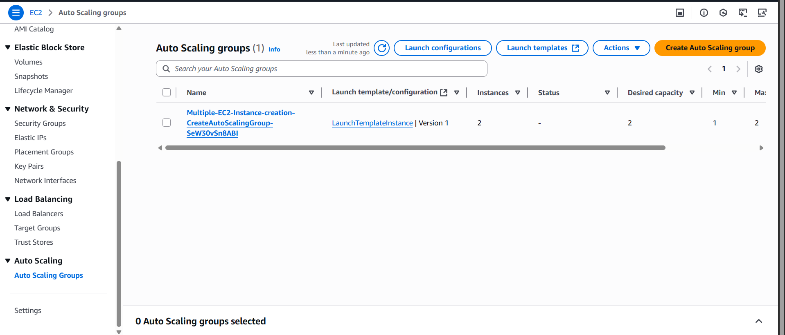
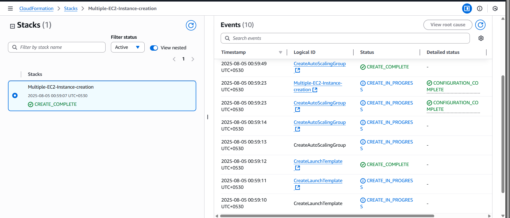

# EC2 Instance Creation from Snapshot in a Different Region using CloudFormation

This project demonstrates how to **create an EC2 instance from an EBS snapshot in a different AWS region** using **CloudFormation**.

---

## 🏗️ Steps in Code

1. Start with a snapshot of an **EBS volume** in one AWS region.
2. **Copy the snapshot** to the target AWS region.
3. Use the copied snapshot to **create a new EBS volume** in the target region.
4. Launch a new **EC2 instance** from the newly created EBS volume.

---

## 🚀 Deployment Steps

1. Go to **AWS Management Console**.
2. Navigate to **CloudFormation**.
3. Click **Create Stack** → **With new resources (standard)**.
4. Choose **Upload a template file** or **Specify an Amazon S3 template URL** or **Sync to GitHub**.
5. Upload your **YAML** file and click **Next**.
6. Enter the stack name and required parameters.
7. Review the settings and click **Create stack**.
8. Wait for the stack creation to complete.
9. Check the created resources in the **CloudFormation** console.
10. Verify the **EC2 instance** in the EC2 console.

---

## 📌 Notes
- Ensure that the source snapshot is **accessible** (correct permissions set).
- The target region must have **compatible instance types** and **EBS settings** for the snapshot.

---

## 📷 Output Screenshots

### Auto Scaling Created

### CloudWatch Output

