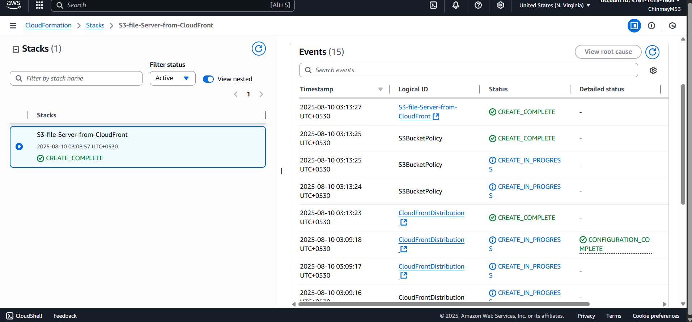
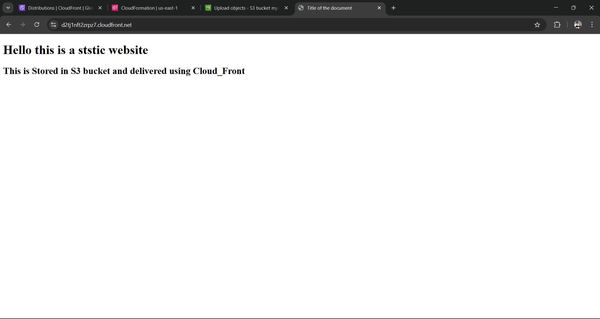

# S3 + CloudFront Setup with CloudFormation

This template creates an **S3 bucket** and sets up a **CloudFront** distribution to serve files from the bucket.

---

## 📜 Code Steps

1. **Create an S3 bucket** with security configurations (encryption, versioning, public access blocked).
2. **Create Origin Access Control (OAC)** for secure CloudFront–S3 integration.
3. **Create a CloudFront distribution** with S3 as origin.
4. **Configure CloudFront distribution settings** (caching, HTTPS redirect, compression).
5. **Create an S3 bucket policy** to allow CloudFront access via OAC.
6. **Output important URLs and resource identifiers** for easy access.

---

## ⚙️ Quick Usage

1. **Deploy CloudFormation stack** → Wait for `CREATE_COMPLETE`.
2. **Upload files** to the S3 bucket.
3. **Access via CloudFront URL** (Distribution domain name).

---

## 🚀 Deployment Steps

1. Go to **AWS Management Console**.
2. Navigate to **CloudFormation**.
3. Click on **Create Stack** and choose **With new resources (standard)**.
4. Choose **Upload a template file** or **Specify an Amazon S3 template URL** or **Sync to GitHub**.
5. Upload your **YAML** file and click **Next**.
6. Enter the stack name and parameters.
7. Review the settings and click **Create stack**.
8. Wait for the stack creation to complete.
9. Once the stack is created, check the resources in the CloudFormation console.
10. Verify the **S3 bucket** and **CloudFront distribution** in their respective consoles.
11. Manually upload files to the S3 bucket via **AWS Console** or **CLI**.

---

## 📷 Output Screenshots

### CloudFront Output

### Website Output

