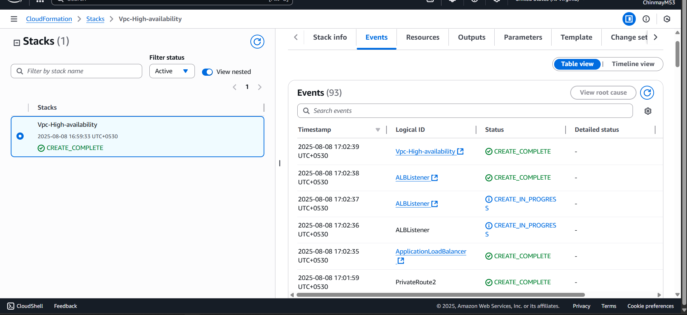

# AWS VPC + Application Load Balancer + Auto Scaling Group Setup

This is a complete **AWS CloudFormation** template for creating:

- A **VPC** with **2 Availability Zones**
- An **Application Load Balancer (ALB)**
- An **Auto Scaling Group** with **EC2 instances**

It includes all necessary resources and configurations to deploy a **highly available** and **scalable web application**.

---

## 🏗️ Steps in Code

### **VPC Creation**
- Create a custom VPC with a specified CIDR block.
- Create an Internet Gateway (IGW) for outbound internet access.
- Attach the Internet Gateway to the VPC.

### **Public Subnets**
- Create a public subnet in Availability Zone 1.
- Create a public subnet in Availability Zone 2.
- Enable auto-assign public IP addresses for public subnets.

### **Private Subnets**
- Create a private subnet in Availability Zone 1.
- Create a private subnet in Availability Zone 2.

### **Route Tables for Public Subnets**
- Create a route table for public subnets.
- Create a default route in the public route table pointing to the Internet Gateway.
- Associate the public route table with both public subnets.

### **NAT Gateways**
- Allocate an Elastic IP for NAT Gateway in AZ1.
- Allocate an Elastic IP for NAT Gateway in AZ2.
- Create a NAT Gateway in public subnet of AZ1 and associate Elastic IP.
- Create a NAT Gateway in public subnet of AZ2 and associate Elastic IP.

### **Route Tables for Private Subnets**
- Create a route table for private subnet in AZ1.
- Create a default route in the private route table pointing to the NAT Gateway in AZ1.
- Associate the private route table with the private subnet in AZ1.
- Create a route table for private subnet in AZ2.
- Create a default route in the private route table pointing to the NAT Gateway in AZ2.
- Associate the private route table with the private subnet in AZ2.

### **Security Groups**
- Create a security group for the Application Load Balancer (ALB) allowing HTTP and HTTPS from the internet.
- Create a security group for EC2 instances allowing access from the ALB security group.

### **Application Load Balancer & Target Group**
- Create an Application Load Balancer across both public subnets.
- Create a Target Group for the ALB that routes to EC2 instances.
- Create an ALB Listener on port 80 forwarding requests to the Target Group.
- (Optional) Create an ALB Listener on port 443 with HTTPS forwarding to the Target Group.

### **EC2 & Auto Scaling**
- Create a Launch Template (or Launch Configuration) for EC2 instances.
- Create an Auto Scaling Group using the Launch Template in private subnets.
- Attach the Target Group to the Auto Scaling Group so EC2 instances register automatically.

---

## 🚀 Deployment Steps

1. Go to **AWS Management Console**.
2. Navigate to **CloudFormation**.
3. Click on **Create Stack** → **With new resources (standard)**.
4. Choose **Upload a template file** or **Specify an Amazon S3 template URL** or **Sync to GitHub**.
5. Upload your **YAML** file and click **Next**.
6. Enter the stack name and parameters.
7. Review the settings and click **Create stack**.
8. Wait for the stack creation to complete.
9. Check the resources created in the **CloudFormation** console.
10. Verify **EC2 instances** in the EC2 console.

---

## 📷 Output Screenshot

